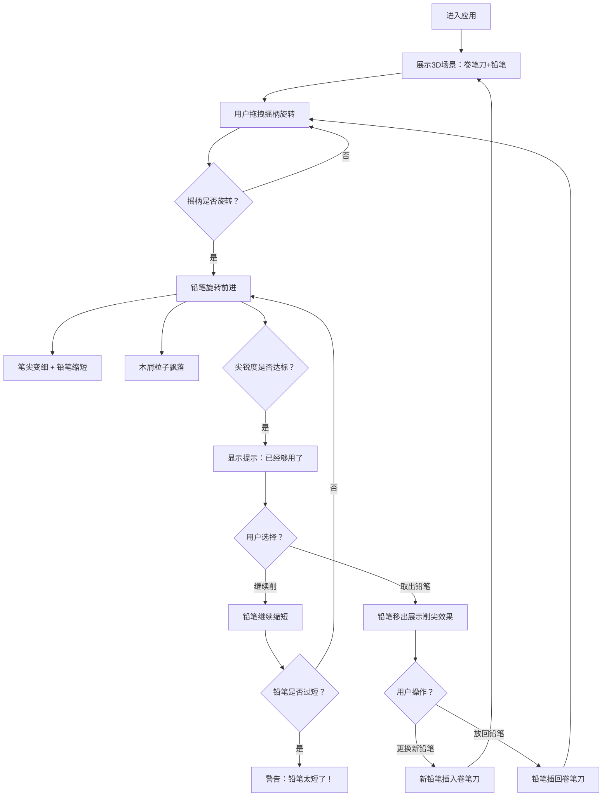

## 1. 产品概述

一款沉浸式3D互动卷笔刀体验应用，模拟真实削铅笔的治愈过程。用户通过鼠标旋转摇柄来削铅笔，享受木屑飘落、笔尖渐细的视觉效果和手感反馈。

- 核心目的：提供放松解压的治愈系互动体验，重现童年削铅笔的温馨记忆
- 目标用户：喜欢解压小游戏、ASMR体验、怀旧情怀的所有用户
- 产品价值：将日常小事转化为精致的数字交互艺术品

## 2. 核心功能

### 2.1 功能模块
1. **主交互页面**：3D场景展示、摇柄交互、削笔动画、木屑效果
2. **状态管理系统**：铅笔尖锐度、铅笔长度、削笔进度
3. **UI控制面板**：提示信息、操作按钮、状态展示

### 2.2 页面详情
| 页面名称 | 模块名称 | 功能描述 |
|---------|---------|----------|
| 主交互页 | 3D场景 | 展示卷笔刀、铅笔、桌面环境的3D模型 |
| 主交互页 | 摇柄交互 | 鼠标拖拽旋转摇柄，控制削笔动作 |
| 主交互页 | 铅笔动画 | 铅笔旋转前进、笔尖逐渐变细、长度缩短 |
| 主交互页 | 木屑系统 | 卷笔刀侧面持续飘落卷曲的木屑粒子 |
| 主交互页 | 状态提示 | 削笔进度提示、"够用了"提示、铅笔过短警告 |
| 主交互页 | 操作按钮 | 取出铅笔查看、更换新铅笔按钮 |
| 主交互页 | 音效系统 | 模拟削铅笔的沙沙声（可选） |

## 3. 核心流程

用户打开应用 → 看到桌面场景中的卷笔刀和铅笔 → 鼠标悬停摇柄出现高亮提示 → 按住鼠标拖拽旋转摇柄 → 铅笔开始旋转前进 → 木屑从卷笔刀侧面飘落 → 笔尖逐渐变细、铅笔逐渐缩短 → 系统提示"已经够用了" → 用户可选择继续削（铅笔变短）或取出铅笔 → 点击取出铅笔 → 铅笔移出展示削尖效果 → 点击更换新铅笔 → 新铅笔插入卷笔刀 → 循环

## 4. 用户界面设计

### 4.1 设计风格
- **主色调**：温暖木色系 - 深胡桃木色(#5D4037)、浅橡木色(#D7CCC8)、铅笔黄(#FFC107)、金属银(#B0BEC5)
- **辅助色**：石墨黑(#212121)、纸张米白(#FFF8E1)、提示蓝(#1976D2)
- **按钮风格**：3D立体按钮，圆角设计，带有悬停微动画和按压反馈
- **字体选择**：标题使用"Playfair Display"优雅衬线字体，正文使用"Noto Sans SC"清晰易读
- **布局风格**：沉浸式全屏3D场景，浮动半透明控制面板，卡片式状态提示
- **装饰元素**：桌面木纹纹理、柔和阴影、温暖环境光、颗粒感噪点叠加

### 4.2 页面设计概述
| 页面名称 | 模块名称 | UI元素 |
|---------|---------|--------|
| 主交互页 | 3D场景 | 暖色调桌面环境、柔和聚光灯、投影效果、景深模糊 |
| 主交互页 | 摇柄交互 | 悬停发光高亮、拖拽光标变化、旋转角度反馈 |
| 主交互页 | 控制面板 | 右下角浮动卡片、半透明毛玻璃背景、优雅按钮 |
| 主交互页 | 状态提示 | 顶部中央滑入动画、渐隐效果、彩色状态标签 |
| 主交互页 | 进度指示 | 铅笔尖锐度进度条、长度百分比显示 |
| 主交互页 | 木屑效果 | 卷曲螺旋形态、自然旋转下落、堆积地面效果 |

### 4.3 响应式设计
- **桌面端优先**：支持鼠标拖拽交互，最佳分辨率1920x1080
- **平板适配**：触控拖拽替代鼠标，保持全屏体验
- **移动端**：简化场景复杂度，触控摇柄区域放大，保证流畅运行

### 4.4 3D场景指南
- **环境与氛围**：温馨书桌场景，米白色桌面带细腻木纹，柔和侧光营造治愈氛围
- **灯光设置**：主光源暖色聚光灯（模拟台灯）+ 环境光补光 + 轮廓光突出物体边缘
- **相机设置**：45度俯视角度，可通过右键拖拽环绕观察，滚轮缩放
- **构图焦点**：卷笔刀位于画面中央偏左，摇柄在右侧易于交互
- **交互动画**：摇柄旋转带惯性衰减、铅笔前进有轻微弹性、取出时有弧线轨迹
- **后期效果**：Bloom泛光（摇柄高亮）、轻微景深、色彩分级增强暖调
- **性能预算**：单一场景、低面数模型、粒子数控制在200以内、目标60fps
