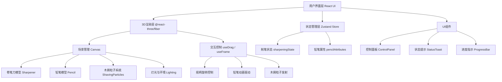

## 1. 架构设计



## 2. 技术选型说明

- **前端框架**：React@18 + TypeScript + Vite
- **3D渲染引擎**：three@0.160 + @react-three/fiber@8 + @react-three/drei@9
- **后期处理**：@react-three/postprocessing
- **状态管理**：zustand@4（轻量级状态管理）
- **样式方案**：tailwindcss@3 + CSS Modules（混合方案）
- **物理/动画**：@react-three/rapier（可选，简单物理）或自定义动画
- **音效**：Web Audio API（程序化生成削笔音效）

**技术选型理由**：
1. React + TypeScript提供类型安全和组件化开发体验
2. @react-three/fiber让Three.js使用声明式JSX，开发效率高
3. drei提供丰富的3D工具组件（OrbitControls、Environment等）
4. zustand极简API，适合管理3D场景的实时状态
5. tailwindcss快速构建精美UI

## 3. 组件路由定义

| 路由路径 | 组件名称 | 功能说明 |
|---------|---------|----------|
| / | App.tsx | 主入口，全局布局与Canvas容器 |
| / | Scene.tsx | 3D场景主容器，整合所有3D对象 |
| / | Sharpener.tsx | 卷笔刀3D模型组件（主体+摇柄） |
| / | Pencil.tsx | 铅笔3D模型组件（木质笔身+可变形笔尖） |
| / | ShavingParticles.tsx | 木屑粒子系统组件 |
| / | Desk.tsx | 桌面环境与道具 |
| / | ControlPanel.tsx | 右下角操作按钮面板 |
| / | StatusToast.tsx | 顶部状态提示组件 |
| / | usePencilStore.ts | zustand铅笔状态管理 |
| / | useAudio.ts | 音效自定义Hook |

## 4. 核心数据模型定义

```typescript
// 铅笔状态枚举
enum PencilState {
  INSERTED = 'inserted',     // 已插入卷笔刀
  SHARPENING = 'sharpening', // 正在削
  REMOVED = 'removed',       // 已取出查看
  REPLACED = 'replaced'      // 刚更换新笔
}

// 铅笔属性接口
interface PencilAttributes {
  id: string;                    // 铅笔唯一标识
  color: string;                 // 笔身颜色
  totalLength: number;           // 总长度（单位：场景单位）
  currentLength: number;         // 当前剩余长度
  sharpness: number;             // 尖锐度 0~1 (0=钝,1=最尖)
  minimumLength: number;         // 最小可用长度
  optimalSharpness: number;      // 最佳尖锐度阈值
  state: PencilState;            // 当前状态
  rotationProgress: number;      // 削笔累计旋转圈数
}

// 削笔会话状态
interface SharpeningSession {
  isDragging: boolean;           // 是否正在拖拽摇柄
  crankAngle: number;            // 摇柄当前角度
  crankAngularVelocity: number;  // 摇柄角速度
  shavingsCount: number;         // 已产生木屑数量
  hasReachedOptimal: boolean;    // 是否已达到最佳尖锐度
}

// 全局Store
interface PencilStore {
  pencil: PencilAttributes;
  session: SharpeningSession;
  actions: {
    updateCrankRotation: (deltaAngle: number) => void;
    removePencil: () => void;
    insertPencil: () => void;
    replaceWithNewPencil: () => void;
    startDragging: () => void;
    stopDragging: () => void;
    reset: () => void;
  };
}
```

## 5. 削笔算法核心逻辑

```
摇柄旋转 → 计算旋转增量角度
    ↓
累计旋转圈数 += 增量 / 2π
    ↓
尖锐度 sharpness = min(累计圈数 / 最佳圈数, 1.0)
    ↓
长度缩短量 = 每次旋转缩短系数 × 增量角度
    ↓
铅笔前端位置 = 基础位置 + 缩短量 × 前进方向
    ↓
每转 N 度 → 发射一批木屑粒子
    ↓
如果 sharpness >= optimalSharpness 且未提示过 → 触发"已经够用了"提示
    ↓
如果 currentLength <= minimumLength → 触发"铅笔过短"警告并锁定
```

## 6. 性能优化策略

1. **模型优化**：所有模型使用低面数几何体，卷笔刀和铅笔控制在2000面以内
2. **粒子优化**：木屑使用InstancedMesh实例化渲染，对象池复用
3. **帧率控制**：useFrame中使用deltaTime做帧率无关动画
4. **状态更新**：zustand选择器避免不必要重渲染
5. **LOD策略**：远处物体使用简化版本
6. **内存管理**：粒子超出范围自动回收，组件卸载清理资源
